# সূচিপত্র

1. **[পরিচিতি](#পরিচিতি)**
    - [Git কি?](#git-কি)
    - [Github কি?](#github-কি)
    - [Git-এর ইতিহাস](#git-এর-ইতিহাস)
    - [Git ব্যবহার করার দরকার কি?](#git-ব্যবহার-করার-দরকার-কি)
  
2. **[ইনস্টলেশন এবং সেটআপ](#ইনস্টলেশন-এবং-সেটআপ)**
    - [Git ইনস্টল করা](#git-ইনস্টল-করা)
    - [Git কনফিগার করা](#git-কনফিগার-করা)
    - [SSH-KEY জেনারেট করা](#ssh-key-জেনারেট-করা)
    - [SSH-KEY গিটহাবে যুক্ত করা](#SSH-KEY-গিটহাবে-যুক্ত-করা)

3. **[গুরুত্বপূর্ণ কনসেপ্টস](#গুরুত্বপূর্ণ-কনসেপ্টস)**
    - [রেপোজিটরি (লোকাল এবং রিমোট)](#রেপোজিটরি-লোকাল-এবং-রিমোট)
    - [Git-এর তিন পর্যায়](#Git-এর-তিন-পর্যায়)

4. **[বেসিক গিট্ কমান্ড](#বেসিক-গিট্-কমান্ড)**
    - [`git init`](#git-init)
    - [`git add`](#git-add)
    - [`git commit`](#git-commit)
    - [`git status`](#git-status)
    - [`git log`](#git-log)
    - [`git reflog`](#git-reflog)
    - [`git rm`](#git-rm)

5. **[ব্রাঞ্চিং এবং মার্জিং](#ব্রাঞ্চিং-এবং-মার্জিং)**
    - [ব্রাঞ্চ কি?](#ব্রাঞ্চ-কি?)
    - [ব্রাঞ্চ তৈরি করা](#ব্রাঞ্চ-তৈরি-করা)
    - [ব্রাঞ্চের তালিকা](#ব্রাঞ্চের-তালিকা)
    - [ব্রাঞ্চ সুইচ করা](#ব্রাঞ্চ-সুইচ-করা)
    - [ব্রাঞ্চ মার্জ করা](#ব্রাঞ্চ-মার্জ-করা)
    - [ব্রাঞ্চ ডিলিট করা](#ব্রাঞ্চ-ডিলিট-করা)

6. **[কমিট ম্যানিপুলেশন কমান্ড](#কমিট-ম্যানিপুলেশন-কমান্ড)**
    - [`git reset` ](#git-reset)
    - [`git stash`](#git-stash)
    - [`git rebase`](#git-rebase)
    - [`git cherry-pick`](#git-cherry-pick)
  
7. **[গিট ইগনোর ফাইলস](#গিট-ইগনোর-ফাইলস)**
   
8.  **[গিট রেফারেন্স](#গিট-রেফারেন্স)**
   
9.  **[রিমোট রেপোজিটরি এবং অ্যাডভান্স টপিক](#রিমোট-রেপোজিটরি-এবং-অ্যাডভান্স-টপিক)**


# পরিচিতি

## Git কি?
[Git](https://www.git-scm.com/) হলো একটা [Version Control System](https://www.geeksforgeeks.org/version-control-systems/). এখন প্রশ্ন হলো Version Control System আবার কি?
সহজ কথায় বললে, আপনার প্রজেক্টের সব ধাপ/পরিবর্তন ট্র্যাক রাখার একটা পদ্ধতি। একটা সহজ উদাহরণের মাধ্যমে বোঝা যাক, মনে করেন আপনি একটা গল্পের বই লেখা শুরু করলেন। প্রতিদিন একপাতা করে লিখেন আর সেটি তারিখ দিয়ে রাখেন। এভাবে আপনি ২০ পাতার একটি বই লেখলেন। বইয়ের নাম দিলেন “কচু ভার্সন:১” । এবার কিছুদিন পর আপনার মনে হলো, এই বইয়ে আরও কিছু যুক্ত করা দরকার। আর এই পরিবর্তন গুলো তারিখ দিয়ে মার্ক করে রাখলেন। আর বইয়ের এই ভার্সনের নাম দিলেন, “কচু ভার্সন:২”। এখন আপনি চাইলেই বইয়ের ভার্সন:১ ও ভার্সন:২ সহজেই Control বা আলাদা করতে পারেন। এটাই Version Control System. আর এই কাজ টাই কোনো সফটওয়্যারের ভার্সন পরিবর্তন, ডেভেলপমেন্ট ও  অসংখ্য ফাইল ট্র্যাকিং করার জন্য আরও নিখুঁত ও আধুনিক ভাবে করতে হয়। Version Control System  এর মাধ্যমে সহজেই একটি সফটওয়ারের যেকোনো ভার্সনে সুইচ করা যায়,সব পরিবর্তন ট্র্যাক করা যায়। এছাড়া আরও অনেক কাজ করা যায়।

## Github কি?
Git এর সব কার্যকলাপ এতক্ষণ আপনার কম্পিউটারে সেভ করে রাখলেন। এখন এটাকে আপনি আবার ক্লাউডে রাখতে পারেন। [GitHub](https://github.com/) মূলত এই সার্ভিসটিই দেয়। এছাড়াও আরো অনেক সুযোগ সুবিধা আছে। যেমন: একসাথে কাজ করার সুযোগ, অটোমেটিক কোড চেক করা ইত্যাদি।

## Git-এর ইতিহাস
[Linus Torvalds](https://en.wikipedia.org/wiki/Linus_Torvalds), Git এর আবিস্কারক। মূলত লিনাক্স কার্নেল ডেভেলপ করার সুবিধার্থে গিট তৈরী করা হয়।
- ২০০৫ সালের এপ্রিল মাসে Git-এর প্রথম ভার্সন রিলিজ হয়।
বর্তমানে Git সবচেয়ে জনপ্রিয় Version Control System.

## Git ব্যবহার করার দরকার কি?
একটা সফটওয়্যার তৈরী করা এমনিতেই অনেক জটিল। তার মধ্যে আবার বার বার কম্যান্ড লাইনে গিয়ে কমিট করা, একশোটা Git কমান্ড চালানোর কি দরকার? দরকার আছে। ধরেন ,আপনি সারা দিন-রাত খাটুনি করে আপনার ই-কমার্স ওয়েবসাইটি আপডেট করলেন। সব ঠিকঠাক চলছিল। হঠাৎ, দেখলেন ওয়েবসাইট ডাউন! এরকম অবস্থায় অনেক কাস্টমার ফিরে যাচ্ছে। ব্যবসার লালবাতি জ্বলে গেছে। আর ঐদিকে আপনি বাগ ফিক্স করতে ব্যস্ত। এখন ভাবছেন যে, কি কারনে যে আপডেট করতে গেলেন! আগের সাইটটি ঠিকই চলছিল। ইস্ যদি আগের ভার্সনে ফিরতে পারতাম!

এখন আপনার প্রজেক্ট যদি Git -এ ট্র্যাক করা থাকে,তাহলে খুব সহজেই আগের ভার্শনে ফিরে যেতে পারবেন। শুধু তাই নয়, বাগ খুঁজে বের করা ও ফিক্স করার ক্ষেত্রেও গিট অনেকভাবে উপকারে আসে। এই হলো গিট ব্যবহারের ছোট্ট একটি উদাহরণ।

# ইনস্টলেশন এবং সেটআপ
## Git ইনস্টল করা
#### Windows
  - [Git ডাউনলোড](https://git-scm.com/download/win) করুন । 
  - অন্য সব সফটওয়্যারের মতো ইনস্টল করুন।
  
#### Linux
  
 - লিনাক্সের ডেবিয়ান বেসড ডিস্ট্রিবিউশনে Git আগে থেকেই ইনস্টল থাকে। আছে কিনা চেক করতে এই কমান্ড `git --version `

যদি না থাকে তাহলে, এই কমান্ড ২ টি টার্মিনালে রান করে Git ইনস্টল করা যাবে।


```bash
sudo apt update
```

```bash
sudo apt install git
```

#### MacOs
 
Homebrew ইনস্টল করা না থাকলে আগে সেটা করে নেন , তারপর এই কমান্ড রান করতে হবে:
```sh
brew install git
```
## Git কনফিগার করা
Git config - গিটের একটি কমান্ড। এই কমান্ডের মাধ্যমে গিটে ইউজার, ইমেইল, এডিটর সহ আরো অনেক কিছু কনফিগার করা যায়। এই কনফিগারেশন সিস্টেম ,লোকাল এবং গ্লোবাল লেভেলে করা যায়।

1. সেট ইউজার নেম
   ```bash
   git config --global user.name "Haider Ali Khan"
   ```
2. সেট ইউজার ইমেইল
   ```bash
   git config --global user.email "haider.sde@gmail.com"
   ```
3. সেট ডিফল্ট এডিটর
    ```bash
   git config --global core.editor "editor"
   git config --global core.editor "code
   ```

## SSH-KEY জেনারেট করা

আপনার কম্পিউটারকে গিটহাবের সাথে যুক্ত করতে SSH KEY সেটআপ করতে হবে। এতে করে আপনাকে বারবার ইউজার নাম, পাসওয়ার্ড দেয়া লাগবেনা। [SSH-KEY](https://docs.github.com/en/authentication/connecting-to-github-with-ssh/about-ssh) কি ? এটা মূলত একটা সিকিউরিটি সিস্টেম। এখানে আপনাকে দুইটা KEY দেয়া হবে। একটা প্রাইভেট KEY, আরেকটা পাবলিক KEY. প্রাইভেট KEY থাকবে আপনার কাছে, মানে আপনার কম্পিউটারে, আর পাবলিক কী থাকবে গিটহাবের কাছে।  তো , আপনি যতবার গিটহাবে কোনোকিছু পাঠাবেন বা গিটহাব থেকে কিছু নিবেন। ততবার এই KEY  মিলিয়ে দেখা হবে যে, আপনার কাছে যে প্রাইভেট কী আছে সেটার পেয়ার KEY এটাই কিনা। তো এখন SSH-KEY  পেয়ার সেট করতে যা যা করতে হবে :

1. প্রথমে SSH-KEY পেয়া জেনারেট করতে হবে।
```bash
ssh-keygen -t rsa -b 4096 -C "haider.sde@gmail.com"
```
2. SSH-KEY কে SSH-agent এর সাথে যুক্ত করতে হবে।
```bash
eval "$(ssh-agent -s)"
ssh-add ~/.ssh/id_rsa
```
3. SSH public KEY কপি করতে হবে।
```bash
cat ~/.ssh/id_rsa.pub
```

## SSH-KEY গিটহাবে যুক্ত করা
এবার SSH -KEY কে গিটহাবের সাথে যুক্ত করার পালা। প্রথমেই একটা গিটহাব একাউন্ট খুলুন। খুবই সহজ তাই সেটা আর দেখলাম না। এবার এই স্টেপ ফলো করুন :

1. প্রথমে settings -এ যান।
2. এবার সাইড বার থেকে  'SSH and GPG keys' অপশনে যান।
3. New SSH key বা  Add SSH key অপশনে ক্লিক করেন।
4. এবার যেকোনো একটা টাইটেল দেন।
5. public key টা key এর ঘরে পেস্ট করে দেন।
6. Add SSH Key তে ক্লিক করেন।

এবার চেক করে দেখা যাক সব ঠিক মত কাজ করছে কিনা।
```bash
ssh -T git@github.com
```
এ পর্যন্ত সব ঠিক থাকলে গিটহাবের সাথে আপনার কম্পিউটার যুক্ত হয়ে গেল। আরও বিস্তারিত প্রসেস দেখতে [Github Docs](https://docs.github.com/en/authentication/connecting-to-github-with-ssh/adding-a-new-ssh-key-to-your-github-account) ভিজিট করতে পারেন।

# গুরুত্বপূর্ণ কনসেপ্ট সমূহ

এবার Git -এর কিছু গুরুত্বপূর্ণ কনসেপ্ট জেনে নেয়া যাক।
## রেপোজিটরি (লোকাল এবং রিমোট)
 যেই ফোল্ডারে আপনার পুরো প্রজেক্ট, কোড আছে এবং গিট সেটাকে ট্র্যাক রাখছে সেটাই রেপোজিটরি (সংক্ষেপে রেপো) । আপনার কম্পিউটারে যেই রেপো আছে সেটা লোকাল রেপো আর যেটা গিটহাবে আছে সেটা রিমোট রেপো। রিমোট রেপো তে একসাথে অনেক ডেভেলপার মিলে কাজ করা যায়। পুল, পুশ, ফেচ কমান্ডগুলো রিমোট রেপো নিয়ে কাজ করতে ব্যবহার করা হয়। 

## Git-এর তিন পর্যায়?
আপনার প্রজেক্ট ৩ তা স্টেটে থাকতে পারে :মডিফাইড, স্টেজেড এবং কমিটেড । ধরেন , আপনি যখন কোডে কোনো চেঞ্জ করেছেন ,সেটা হলো মডিফাইড স্টেট। এরপর চেঞ্জ গুলো যাতে গিট্ ট্র্যাক করে সেজন্য `git add ` কম্যান্ড দিয়ে স্টেজ করা লাগে। তারপর কমিট বা টোটাল এই চেঞ্জকে কিছু একটা লিখে সেভ করতে হয়।

মনে করেন , একজন শিল্পী প্রথমে অনুষ্ঠানে এসে মেকআপ করে (মডিফাইড স্টেট ), তারপর স্টেজে (স্টেজেড ) উঠে , আর তারপর গান (কমিট ) করে। এই হলো গিটে হিস্ট্রি ট্র্যাকিং এর ৩ তা পর্যায়।


# বেসিক গিট কমান্ড
এবার আমরা গিটের আসল পাওয়ার দেখবো। প্রথমেই কিছু বেসিক কম্যান্ড দেখে নেয়া যাক। 
## git init
আমি প্রজেক্টের ডিরেক্টরি বা ফোল্ডারে গিয়ে প্রথমেই কম্যান্ড লাইন থেকে
```bash
git init
```
কমান্ড রান করবো।


ফলে .git নাম একটা হিডেন ডিরেক্টরি ক্রিয়েট হবে।
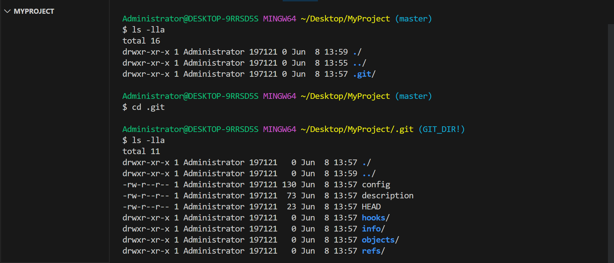

এর মধ্যেই প্রজেক্টের সব কিছু গিট ট্র্যাক করে রাখে।

## git add
এবার গিটকে আমি বলে দিবো কোন কোন ফাইল ট্র্যাক করতে হবে।  যে ফাইল ট্র্যাক করতে চাই,
```bash
git add file1.txt
```
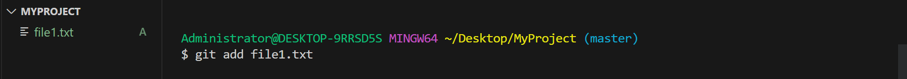
আর যদি রেপোর সব কিছু ট্র্যাক করতে চাই তাহলে ,
```
git add .
```
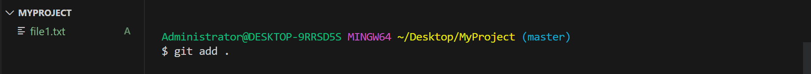
এই পর্যায়ে গিট্ মূলত চেঞ্জেস স্টেজেড করে রাখলো।
## git commit
এবার কমিট করতে হবে। এর জন্য,এই কমান্ড রান করতে হবে।
```bash
git commit -m "Add file1.txt"
```
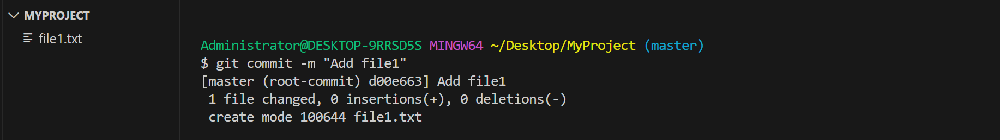

`-m`  ফ্ল্যাগ দিয়ে মেসেজ বুঝায়। কমিট মেসেজে প্রধানত কি চেঞ্জ করেছেন সেটা ছোট করে লিখতে হয়।

## git status
এই কমান্ডের মাধ্যমে রেপো কি অবস্থায় আছে সেটা দেখা যায়। 
```bash
git status
```
যেমন, file1.txt ক্রিয়েট করার পর আমাকে দেখাচ্ছে,
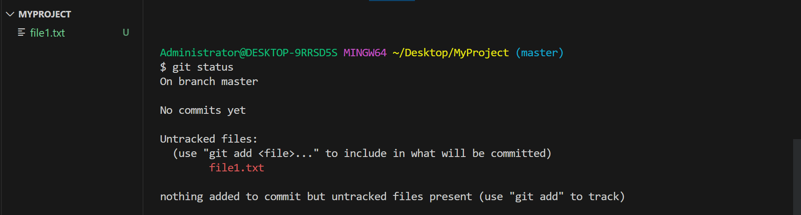
ফাইল untracked অবস্থায় আছে। ট্র্যাক করতে কি করা উচিত সেটাও কিন্তু সাজেস্ট করছে। এবার git add ও git commit করার পর দেখাচ্ছে "nothing to commit ". 
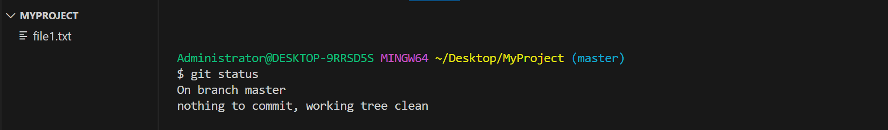
মানে সব কমিট করা আছে।    
## git log
কমিট হিস্ট্রি দেখতে চাইলে আমি,
```bash
git log
```
কমান্ড রান করবো।

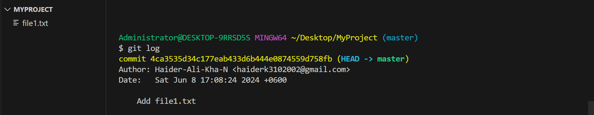
এখানে মেইন ব্রাঞ্চে যত কমিট আছে সবগুলি দেখাচ্ছে।
## git reflog
এপর্যন্ত রেপো তে আমি যা যা কমান্ড চালিয়েছি সবকিছু এই কমান্ডের মাধ্যমে দেখা যায়।
```
git reflog
```
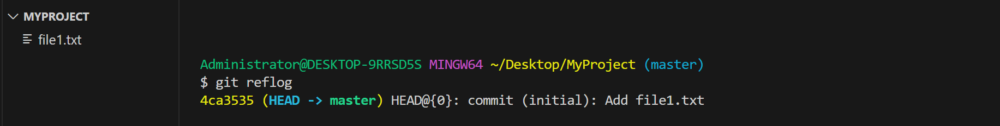
এটা খুবই গুরুত্বপূর্ণ একটা কমান্ড। এটার আরো বিস্তারিত ব্যবহার পরে দেখবো।

# ব্রাঞ্চিং এবং মার্জিং
ব্রাঞ্চিং এবং মার্জিং Git  -এর সবচেয়ে গুরুত্বপূর্ণ ও ইউনিক ফীচার।
## ব্রাঞ্চ কি?
Branch অর্থ শাখা। গাছের যেমন কান্ড, শাখা, প্রশাখা থাকে অনেকটা সেরকম। আমি যখন একটা রেপো তৈরি করি তখন 'master' ব্রাঞ্চ নামের একটা ব্রাঞ্চ আগে থেকেই থাকে। এরপর আমি ভাবলাম প্রজেক্টে আরো কিছু ফীচার যুক্ত করবো। কিন্তু আমি চাই, যদি কোনো কারণে নতুন ফীচার কাজ না করে তাহলে আমি যেন আবার  'master' ব্রাঞ্চে ফিরে আসতে পারি। সেজন্য, আমি মেইন ব্রাঞ্চ থেকে আরেকটা ব্রাঞ্চ বা শাখা তৈরী করবো। আর এই ব্রাঞ্চের নাম দিলাম 'feature-1'। সাথে সাথে মেইন ব্রাঞ্চের হুবহু একটা 'feature-1' তৈরী হয়ে যাবে। মাস্টার ব্রাঞ্চ থেকে 'feature-1' ব্রাঞ্চ তৈরী করার ফলে 'feature-1' ব্রাঞ্চে মাস্টার ব্রাঞ্চের সবকিছু কপি হয়ে আসবে। আবার 'feature-1' থেকে 'feature-3' ব্রাঞ্চ তৈরী করা হলে 'feature-3' ব্রাঞ্চে 'feature-1' এর সবকিছু চলে আসবে। কিন্তু উল্টোদিকে কোনো কিছু যাবেনা। 'feature-1' -এ কোনো চেঞ্জ করলে সেটা 'master' ব্রাঞ্চে যাবেনা। অর্থাৎ, মাদার ব্রাঞ্চ থেকে চাইল্ড ব্রাঞ্চ সব বৈশিষ্ট অটোমেটিক পেয়ে যাবে। এখন আমি 'master' ব্রাঞ্চের কোনো পরিবর্তন না করেই আমার মতো কাজ করতে পারি।  এভাবেই মূলত ব্রাঞ্চ কাজ করে। এছাড়াও আরো অনেক কিছু করা যায়।


ছবিতে যেমন দেখছেন, সবুজ লাইন টা 'master' ব্রাঞ্চ। 'master' ব্রাঞ্চ থেকে গোলাপি রঙের 'feature-1', নীল রঙের 'feature-2' বিভিন্ন নামের ব্রাঞ্চ তৈরী করা হয়েছে। আবার সেগুলো তে বিভিন্ন রকম চেঞ্জ করা হয়েছে।

## মার্জিং কি?
Merge অর্থ একত্র করা। এখানে ২ টা ব্রাঞ্চ একত্র করাকে মার্জ করা বলে। ধরেন, আমি 'feature-1' নামের ব্রাঞ্চে যে কাজ করেছি সেইসব ঠিকঠাক মতো কাজ করছে। এবার আমি সেসব 'master' ব্রাঞ্চে যুক্ত করতে চাই।  এর জন্য আমাকে 'master' আর 'feature-1' ব্রাঞ্চ মার্জ করতে হবে।


ছবিতে আবার লক্ষ্য করুন , 'master' ব্রাঞ্চ থেকে 'feature-1' নামের ব্রাঞ্চ তৈরি করা হয়েছে ,এবং সেখানে file1 ও file2 তে কিছু চেঞ্জ করা হয়েছে। 'feature-1' এ ২ টি গোলাপি ডট আসলে ২ টা কমিট বুঝাচ্ছে। এবার 'feature-1' কে 'master' ব্রাঞ্চের সাথে মার্জ করা হলে আগের file1 এবং file2 'feature-1' থেকে কোড নিয়ে ওভাররাইট হয়ে গেলো। এভাবে মার্জ করা হয়। 

## ব্রাঞ্চ তৈরি করা
আমি একটা নতুন ব্রাঞ্চ তৈরি করতে নিচের কমান্ড চালাবো।
```bash
git branch feature-1
```
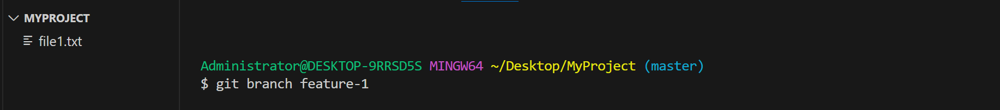
## ব্রাঞ্চের তালিকা
সবগুলো ব্রাঞ্চ দেখতে, এই কমান্ড।
```bash
git branch
```
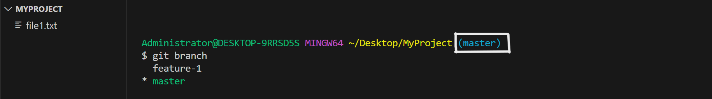

এখানে ব্রাঞ্চের নামের পাশে এস্টেরিস্ক সাইন দিয়ে কারেন্ট ব্রাঞ্চ বুঝায়। আবার উপরের লাইনে দেন পাশেও কারেন্ট ব্রাঞ্চ লেখা থাকে।

## ব্রাঞ্চ সুইচ করা
এক ব্রাঞ্চ থেকে আরেক ব্রাঞ্চে পার হতে। `git checkout <branch-name>` কমান্ড ব্যবহার করা হয়। যেমনঃ
```bash
git checkout feature-1
```
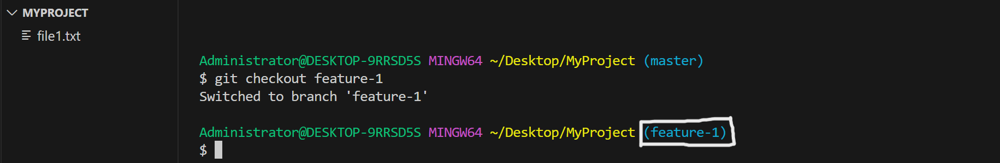

## ব্রাঞ্চ মার্জ করা
এক ব্রাঞ্চের সাথে আরেক ব্রাঞ্চের মার্জ করতে `git merge <branch name>` ব্যবহার করতে হয়।
```bash
git merge feature-1
```
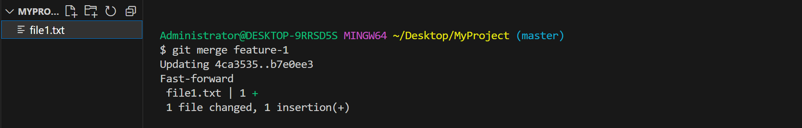

## ব্রাঞ্চ ডিলিট করা
কোনো ব্রাঞ্চ ডিলিট করতে চাইলে ,`git branch -d <branch name>`কমান্ড ব্যবহার করতে হয়।
```
git branch -d feature-1
```
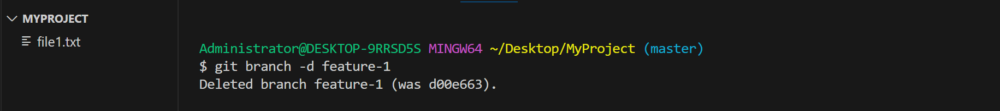

# কমিট ম্যানিপুলেশন কমান্ড
বড় প্রজেক্টে কাজ করতে গেলে আমাদের কমিটের উপর অনেক রকম অপারেশন চালাতে হয়। নিচে সবচেয়ে গুরুত্বপূর্ণ কিছু কমিট ম্যানিপুলেশন কমান্ড নিয়ে আমরা আলোচনা করবো।
## git reset
কোনো কমিট আগের অবস্থায় নিয়ে যেতে বা আনডু করতে `git reset` কমান্ড ব্যবহার করা হয়। রিসেট কমান্ড খুবই শক্তিশালী একটা গিট্ কমান্ড। এই কমান্ডকে বিভিন্ন ক্ষেত্রে ব্যবহার করা যায়। যেমনঃ

- ### git reset HEAD~1
`git reset HEAD~1` কমান্ডটি কোনো ব্রাঞ্চের লাস্ট একটি কমিট শুধু আনডু করে দেয় কিন্তু কমিটের সবকিছু আন-স্টেজ অবস্থায় রেখে দেয়।

 ```bash
 git reset HEAD~1
 ```
 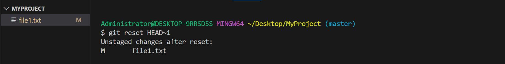
 এখানে গিট হেডের ভ্যালু বাড়িয়ে শেষ ২, ৩, ৪ কমিট আনস্টেজ করা যায়।
 
- ### git reset --hard HEAD~1
 `git reset --hard HEAD~1` কমান্ডটি আপনার ব্রাঞ্চের লাস্ট একটি কমিটের সবকিছু একবারে মুছে ফেলে। তাই এই কমান্ড সাবধানে ব্যবহার করা উচিত।
 ```bash
 git reset --hard HEAD~1
 ```
 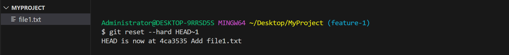
    
 - ### git reset --hard origin/main
  লোকাল রেপোর সবকিছু মুছে ফেলে যদি রিমোট রেপোর মেইন ব্রাঞ্চের অবস্থায় ফিরে যেতে চান তাহলে এই কমান্ড ব্যবহার করতে হবে।
  ```bash
  git reset --hard origin/main
  ```
  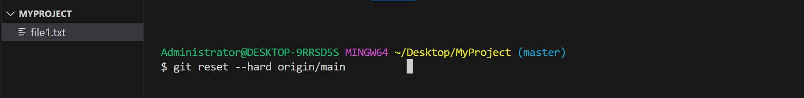

 - ### git reset ---hard HEAD@{1}
 এই কমান্ড ব্যবহার করে আগে চালানো যেকোনো কমান্ডকে আনডু করা যায়। আর এই HEAD গুলো `git reflog` কমান্ড থেকে পাওয়া যাবে। `git reflog` মূলত HEAD এর উপর কি কি কমান্ড চালানো হয়েছে তা হিস্ট্রি হিসেবে রেখে দেয়। যেমনঃ
 ```bash 
 git reflog
 ```
 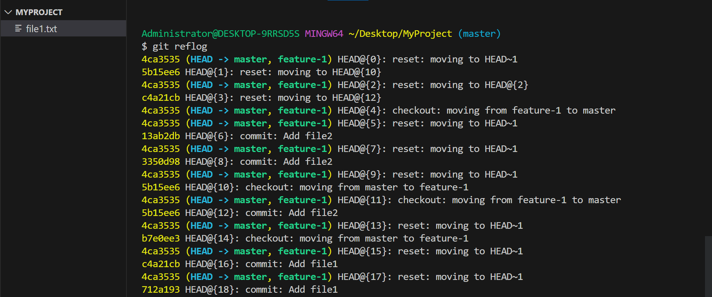

 HEAD@{8} -এ যেতে হলে,
 ```bash
 git reset --hard HEAD@{8}
 ```
 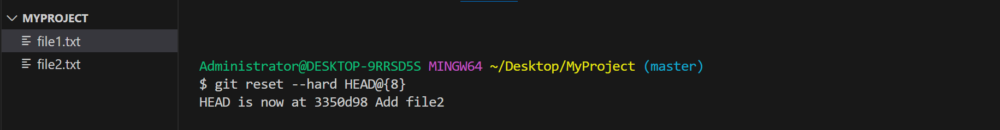

এই কমান্ড ব্যবহার করতে হবে। যেমন স্ক্রিনশটে দেখা যাচ্ছে file2 আবার ফিরে এসেছে। তার কারণ হলো আমি, আমি যে  'Add file2' কমিট করেছিলাম , তা HEAD@{8} -এ সেভ হয়ে আছে। এরপর আমি কমিট ডিলিট করে দিই। এখন আমি আবার ` git reset --hard HEAD@{8}` কমান্ডের মাধ্যমে এভাবে ফিরিয়ে আনতে পারি।

## git stash

Stash অর্থ লুকিয়ে রাখা। `git stash `কমান্ডের মাধ্যমে কোনো স্টেজেড চেঞ্জেস কে লুকিয়ে রাখা যায়। ওই অবস্থায় রেখেই অন্য সব কাজ করা যায়। যেমন ধরেন , আপনি কোনো নতুন কোড যুক্ত করলেন কিন্তু আপনি সেসব এখনই অ্যাপলাই করতে চান না। অন্য কোথাও রেখে দিতে চান। সেজন্য stash করে বা লুকিয়ে রাখতে পারেন। 
- ### git stash
stash করতে।
```bash
git stash
```
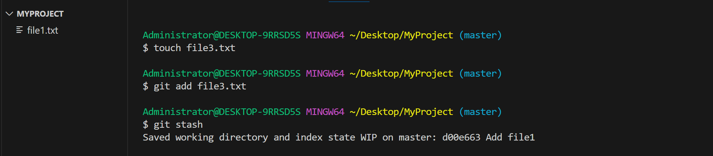

- ### git stash list
কি কি Stash করা আছে তার লিস্ট দেখতে।
```bash
  git stash list
```
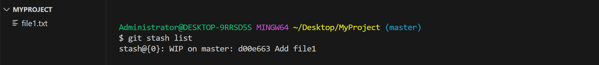

- ### git stash apply [stash_id]
Stash লিস্ট থেকে কোনো স্ট্যাশ করা ফাইল কে অ্যাপলাই করতে।
```bash
git stash apply[stash_id]
```
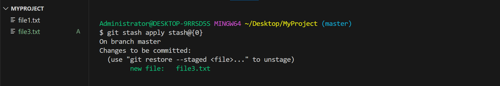

- ### git stash pop
সর্বশেষ স্ট্যাশ করা  ফাইল কে অ্যাপলাই করতে।
  ```bash
git stash pop
```
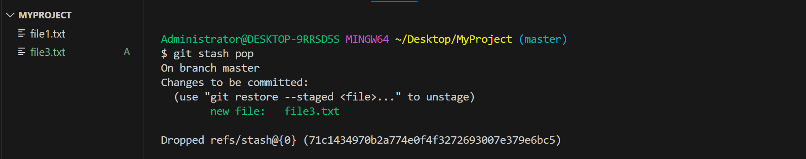

- ###  git stash show [stash_id]
  Stash লিস্ট থেকে কোনো স্ট্যাশ করা ফাইলের মধ্যে কি কি আছে সেটা দেখতে।
   ```bash
  git stash show [stash_id]
  ```
  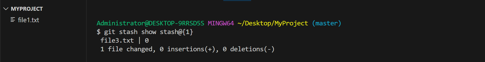

- ###  git stash drop[stash_id]
Stash লিস্ট থেকে কোনো স্ট্যাশকে ডিলিট করতে।
  ```bash
git stash drop [stash_id]
```
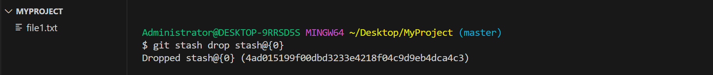


- ###  git stash clear
সকল Stash স্ট্যাসকে সম্পূর্ণ ডিলিট করে দিতে।
  ```bash
git stash clear
```
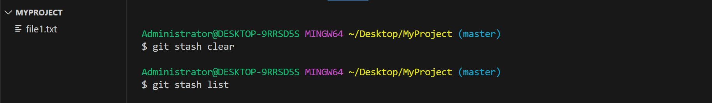

## git rebase
- ### git rebase [branch name]
 `git rebase` গিটের সবচেয়ে গুরুত্বপূর্ণ কমান্ড গুলোর মধ্যে একটি। এই কমান্ডের মাধ্যমে চাইল্ড ব্রাঞ্চের কমিটকে মাদার ব্রাঞ্চের কমিটের সাথে যুক্ত করা হয়। কমান্ডটির মাধ্যমে গিট্ নতুন কমিট জেনারেট করে যুক্ত করে।
 ```bash
 git rebase feature-1
 ```
 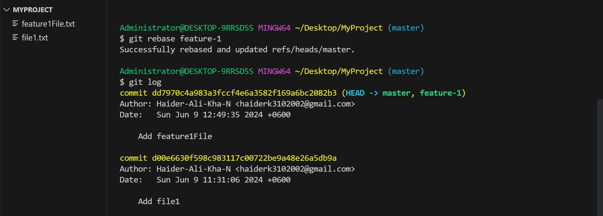

 - ### git rebase -i HEAD~3
 এই কমান্ডের মাধ্যমে যেকোনো কমিট চেঞ্জ করা যায় । মনে করেন, আমি চাই শুধু কমিট-২ টা চেঞ্জ করবো। সেক্ষেত্রে `git rebase -i HEAD~3` কমান্ড দিলে শেষের ৩ তা কমিট চেঞ্জ করার এক্সেস দিবে। এখন আমি আমার প্রয়োজন মত কমিট পরিবর্তন করে নিতে পারবো। এর জন্য কয়েকটি ধাপ করতে হবে।

১. `git rebase -i HEAD~3` কমান্ড রান করার পর প্রথমে ভীম এডিটর ওপেন হবে।
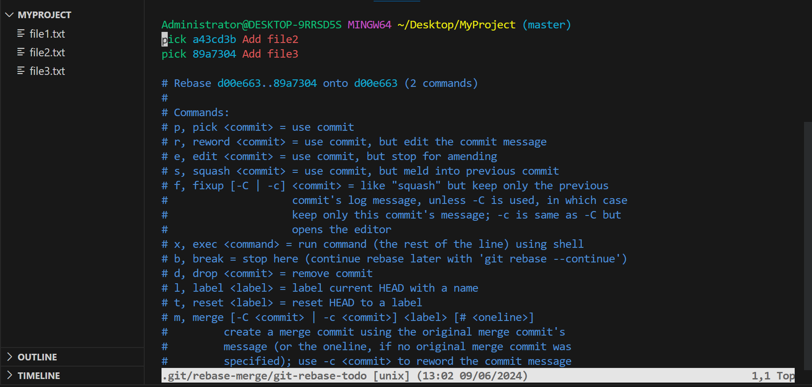

২.এবার ইন্টারেক্টিভ মোডে(press 'i') গিয়ে, যেই কমিট চেঞ্জ করতে চাই তার পাশে 'pick' লেখা এডিট করে 'edit' লিখতে হবে। এরপর (:wq ) press করে এডিটর থেকে বের হয়ে শটে হবে। এখন আপনি ২ নং কমিট টা এডিট করতে পারবেন।
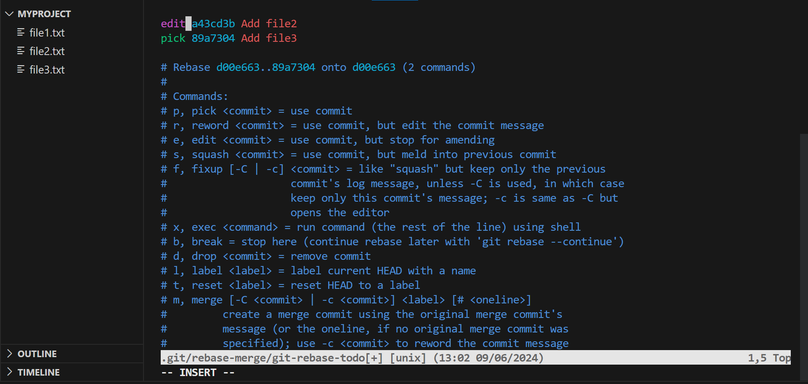


৩. এডিট করা শেষ হলে  `git rebase --continue` কমান্ড রান করতে হবে।

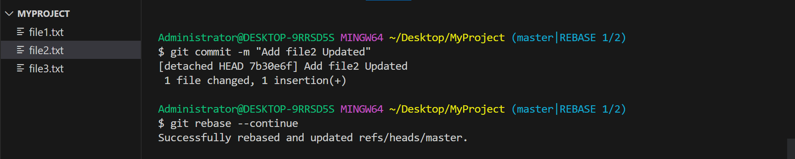

এভাবে মাঝের যেকোনো কমিট চেঞ্জ করা যায়। 
## git cherry-pick [commit hash]
`git cherry-pick` একটি অসাধারণ গিট্ কমান্ড। এই কমান্ডের মাধ্যমে যেকোনো ব্রাঞ্চের যেকোনো কমিটকে অন্য ব্রাঞ্চে কপি - পেস্ট করা যায়। মনে করেন, আপনি ফীচার ব্রাঞ্চে এক টুকরো কোড যুক্ত করে দেখলেন ভালোই কাজ করছে। সেখানে নতুন যুক্ত করা ৩ তা কমিটের মধ্যে আপনি শুধু ২নম্বর টি কপি করে মেইন ব্রাঞ্চে নিতে চাচ্ছেন। সেই ক্ষেত্রে আপনি এই কমান্ড ব্যবহার করে কাজটি করতে পারেন।
```bash
git cherry-pick 7910e187dbf570c573016f104fe1683950d00e6b
```

এখানে আমি 'feature-1' ব্রাঞ্চের শেষ কমিট টা 'master' ব্রাঞ্চে কপি করতে চাই। সেজন্য প্রথমেই কমিটের হ্যাশ কপি করে নিবো।

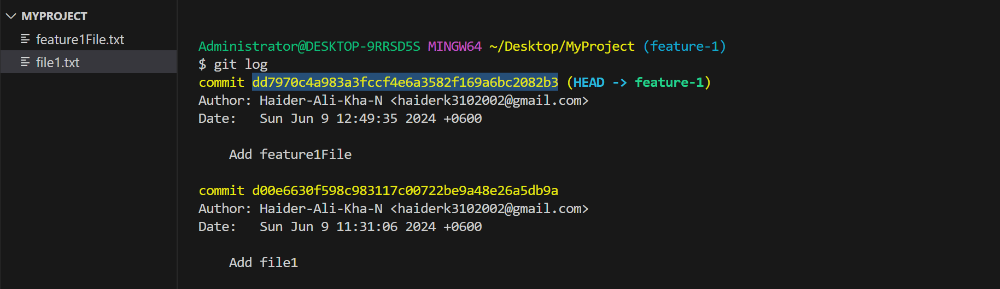

এরপর ব্রাঞ্চ সুইচ করে 'master' ব্রাঞ্চে গেলাম। এখন `git cherry-pick` কমান্ড ব্যবহার করে খুব সহজেই কিন্তু'feature-1' ব্রাঞ্চ থেকে 'Add featureFile' কমিট টা কপি করে আনতে পেরেছি। 

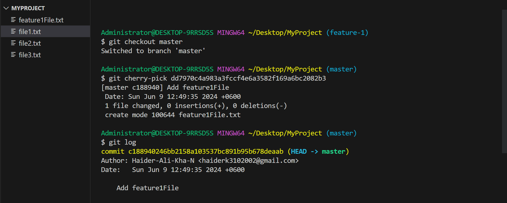


# গিট ইগনোর ফাইলস

অপ্রয়োজনীয় বা সিকিউর ফাইল যাতে রিমোট রিপোসিটোরিতে না যায় সেজন্য লোকাল প্রজেক্টের রুট ডিরেক্টরিতে  .gitignore নামের একটা ফাইল রাখতে হয়। এই ফাইলের মধ্যে যেসব ফাইল আমি চাইনা যে রিমোটে যাক সেসব ফাইলের নাম মেনশন করে দিবো।


# গিট রেফারেন্স
 - [Git Official Documentation](https://git-scm.com/doc)
 - [Git tutorial](https://www.tutorialspoint.com/git/index.htm)


# রিমোট রেপোজিটরি এবং অ্যাডভান্স টপিক
- আপনাদের চাহিদার উপর ভিত্তি করে শীঘই আরো বিষয়ে পাবলিশ করা হবে।
- কোনো বিষয়ে জানতে আমাকে ([Haider Ali Khan](https://www.linkedin.com/in/haider-ali-khan-bd/)) যোগাযোগ করতে পারেন।